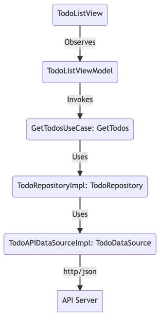

# Clean Architecture: Typescript and React

Ao empregar uma arquitetura limpa, você pode projetar aplicativos com acoplamento muito baixo e independente de detalhes técnicos de implementação, como bancos de dados e estruturas. Dessa forma, o aplicativo se torna fácil de manter e flexível para mudar. Também se torna intrinsecamente testável.

## Estrutura de pastas

A estrutura de pastas/grupos do projeto assume a seguinte forma:

    ├── Core
    ├── Data
    ├── Domain
    └── Presentation

# Camada de Domínio: model, usecase e Repository

Vamos começar com a Camada de Domínio.

Da mesma forma, a camada de domínio do nosso projeto deve especificar e descrever O QUE nosso aplicativo faz. Nesta pasta, usaríamos modelos, interfaces de repositório e casos de uso.

    ├── Core
    ├── Data
    ├── Presentation
    └── Domain
        ├── Model
        │   ├── Todo.ts
        │   └── User.ts
        ├── Repository
        │   ├── TodoRepository.ts
        │   └── UserRepository.ts
        └── UseCase
            ├── Todo
            │   ├── GetTodos.ts
            │   ├── GetTodo.ts
            │   ├── DeleteTodo.ts
            │   ├── UpdateTodo.ts
            │   └── CreateTodo.ts
            └── User
                ├── GetUsers.ts
                ├── GetUser.ts
                ├── DeleteUser.ts
                ├── UpdateUser.ts
                └── CreateUser.ts

## Domain: Model

Modelo : um modelo normalmente representa um objeto do mundo real relacionado ao problema. Nesta pasta, normalmente manteríamos classes para representar objetos. por exemplo, Todo, Usuário, Produto, etc.

src/Domain/Model/Todo.ts

interfaces, nas palavras mais simples, descrevem a estrutura do objeto, o que significa que descreve como o objeto deve se parecer.
src/Domain/Model/Todo.ts

```javascript
export interface Todo {
  id: number;
  title: string;
  isComplete: boolean;
}
```

Exibiremos esses itens em uma exibição de lista

src/test/Todo.test.tsx

```javascript
import React from "react";
import { render, screen } from "@testing-library/react";
import { Todo } from "../Domain/Model/Todo";

test("Deve funcionar a interface", () => {
  const todo = {
    id: 1,
    title: "Fazer um usecase",
    isComplete: false,
  };

  function getTodoDetail(todo: Todo) {
    return `${todo.id} ${todo.title} ${todo.isComplete}`;
  }

  expect(getTodoDetail(todo)).toBe("1 Fazer um usecase false");
});
```

## Domain: Repository

Repositório : Contêiner para todas as interfaces do repositório. O repositório é um local central para manter todas as operações específicas do modelo. Nesse caso, a interface do repositório Todo descreveria os métodos do repositório. A implementação real do repositório será mantida na camada de dados.

```javascript
src / Domain / Repository / TodoRepository.ts;

import { Todo } from "../Model/Todo";

export interface TodoRepository {
  getTodos(): Promise<Todo[]>;
}
```

## Domain: UseCase Todo

UseCases : Container para listar todas as funcionalidades do nosso aplicativo. por exemplo, Obter Todos, Excluir Todo, Criar Todo, Atualizar Todo

src/Domain/UseCase/Todo/GetTodos.ts

```javascript
import { Todo } from "../../Model/Todo";
import { TodoRepository } from "../../Repository/TodoRepository";

export interface GetTodosUseCase {
    invoke: () => Promise<Todo[]>

}

export class GetTodos implements GetTodosUseCase {
    private todoRepo: TodoRepository
    constructor(_todoRepo: TodoRepository) {
        this.todoRepo = _todoRepo;
    }

    async invoke() {
        return this.todoRepo.getTodos()
    }
}
```

Agora com GetTodosUseCase podemos codificar o repositório de tarefas

# Camada de Dados: Repository e DataSource

A camada de DADOS manterá todo o código relacionado à dependência externa quanto a COMO eles são implementados:

    ├── Core
    ├── Domain
    ├── Presentation
    └── Data
        ├── Repository
        │   ├── TodoRepositoryImpl.ts
        └── DataSource
            ├── TodoDataSource.ts
            ├── API
            │   ├── TodoAPIDataSourceImpl.ts
            │   └── Entity
            │       ├── TodoAPIEntity.ts
            │       └── UserAPIEntity.ts
            └── DB
                ├── TodoDBDataSourceImpl.ts
                └── Entity
                    ├── TodoDBEntity.ts
                    └── UserDBEntity.ts

Repositório : implementações de repositório

## Data: DataSource

DataSource : Todas as interfaces e entidades da fonte de dados. Uma entidade representa uma única instância de seu objeto de domínio salva no banco de dados como um registro. Ele tem alguns atributos que representamos como colunas em nossas tabelas de banco de dados ou endpoints de API. Não podemos controlar como os dados são modelados na fonte de dados externa, então essas entidades devem ser mapeadas de entidades para modelos de domínio nas implementações

## Data: DataSource interface

escrever uma interface para o TodoDatasource
src/Data/DataSource/TodoDataSource.ts

```javascript
import { Todo } from "../../Domain/Model/Todo";

export default interface TodoDataSource {
    getTodos(): Promise<Todo[]>;
}
```

## Data: Entity

fazer a entidade todo

src/Data/DataSource/API/Entity/TodoAPIEntity.ts

```javascript
export interface TodoAPIEntity {
  id: number;
  title: string;
  completed: boolean;
}
```

## Data: DataSource implementation

Temos o suficiente para escrever uma implementação dessa interface e vamos chamá-la de TodoAPIImpl:

src/Data/DataSource/API/TodoAPIDataSource.ts

```javascript
import { Todo } from "../../../Domain/Model/Todo";
import TodoDataSource from "../TodoDataSource";
import { TodoAPIEntity } from "./Entity/TodoAPIEntity";

const BASE_URL = "https://jsonplaceholder.typicode.com";

interface TypedResponse<T = any> extends Response {
    json<P = T>(): Promise<P>;
}

function myFetch<T>(...args: any): Promise<TypedResponse<T>> {
    return fetch.apply(window, args);
}

export default class TodoAPIDataSourceImpl implements TodoDataSource {
    async getTodos(): Promise<Todo[]> {
        let response = await myFetch<TodoAPIEntity[]>(`${BASE_URL}/todos`);
        let data = await response.json();
        return data.map((item) => ({
            id: item.id,
            title: item.title,
            isComplete: item.completed,
        }));
    }
}
```

a função getTodos desta fonte de dados retorna uma lista de Todo. Então, temos que mapear TodoEntity -> Todo: Antes de escrevermos nosso TodoRepositoryImpl, vamos escrever a interface para isso na camada de Domínio

# Camada de Apresentação: Presentation

A camada de APRESENTAÇÃO manterá todo o código relacionado ao consumidor sobre COMO o aplicativo irá interagir com o mundo externo. A camada de apresentação pode ser WebForms, Command Line Interface, API Endpoints, etc. Neste caso, seriam as telas de uma Lista de Todos e seu modelo de visualização que a acompanha.

      ├── Core
      ├── Data
      ├── Domain
      └── Presentation
          └── Todo
              └── TodoList
                  ├── TodoListViewModel.tsx
                  └── TodoListView.tsx

## Presentation: DataSource implementation

podemos escrever o modelo de exibição de nossa apresentação e visualizar

src/Presentation/Todo/TodoList/TodoListView.tsx

```javascript
import { useEffect } from "react";
import useViewModel from "./TodoListViewModel";
import { List, ListItem, ListItemIcon, Checkbox, ListItemText } from "@mui/material";

export default function TodoListView() {
  const { getTodos, todos } = useViewModel();

  useEffect(() => {
    getTodos();
  }, []);

  return (
    <List>
      {todos.map((todo, i) => {
        return (
          <ListItem key={i}>
            <ListItemIcon>
              <Checkbox checked={todo.isComplete} />
            </ListItemIcon>
            <ListItemText primary={todo.title} />
          </ListItem>
        );
      })}
    </List>
  );
}
```

src/Presentation/Todo/TodoList/TodoListViewModel.ts

```javascript
import { useState } from "react";
import TodoAPIDataSourceImpl from "../../../Data/DataSource/API/TodoAPIDataSource";
import { TodoRepositoryImpl } from "../../../Data/Repository/TodoRepositoryImpl";
import { Todo } from "../../../Domain/Model/Todo";
import { GetTodos } from "../../../Domain/UseCase/Todo/GetTodos";

export default function TodoListViewModel() {
    const [todos, setTodos] = useState<Todo[]>([]);

    const UseCase = new GetTodos(
        new TodoRepositoryImpl(new TodoAPIDataSourceImpl())
    );

    async function getTodos() {
        setTodos(await UseCase.invoke());
    }

    return {
        getTodos,
        todos,
    };
}
```



guia markdown: https://docs.pipz.com/central-de-ajuda/learning-center/guia-basico-de-markdown#open
